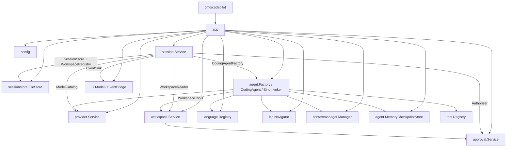

# CodePilot 当前上下文、Workspace / Worktree / Session 与任务恢复机制梳理

> 历史基线说明：本文记录模块化改造开始前的源码事实，保留用于迁移对照，不代表 2026-08-24 的当前实现。当前落盘格式、依赖关系和完整性判断以 `modular-architecture-migration.md` 第 17 节及 `product-completion-roadmap.md` 为准。
>
> 本文只依据当前项目源码与测试进行分析，没有参考 `docs` 目录中的既有文档。源码状态以本文生成时的工作区为准。

## 1. 结论先行

当前实现可以概括为：

- **Agent Loop 已形成清晰的分层闭环**：`session.Service` 管业务生命周期，`agent.CodingAgent` 管单 turn 编排，`EinoInvoker` 管模型/工具循环，`workspace.Service` 管 worktree 内的真实读写与命令执行。
- **完成态会话可恢复**：session 元数据、用户/助手最终消息、turn 结果、patch 证据会落盘；重新启动后，可以恢复已完整写入的历史并继续发起新 turn。
- **上下文管理属于“调用前临时投影”**：完整消息历史仍被加载到内存；在每次模型调用前，旧历史才被摘要或裁剪。摘要和摘要缓存不落盘。
- **Eino checkpoint 不是任务级持久化**：它只保存在当前进程内存中，只服务于同一个 `CodingAgent` 在等待审批后的继续执行。进程退出、agent 关闭、切换 session 或切换模型都会丢失 checkpoint。
- **Workspace / Worktree 的安全边界较完整**：Git 路径会被规范化，文件访问有越界、符号链接和敏感文件限制，副作用使用可信 `TurnScope` 和审批策略约束。
- **Workspace 的逻辑聚合不完整**：数据模型把 workspace 定义为逻辑 Git 仓库，但注册新 worktree 时总是新建 workspace，没有按 `GitCommonDir` 复用已有 workspace。因此同一仓库的多个 worktree 实际会被拆成多个 workspace。
- **任务恢复不完善**：运行中 turn、等待审批、部分写入的 turn、提交失败后的重试都没有持久化状态机。重启后统一回到 `idle`，只能恢复已经写下来的片段，不能准确判断或继续上一次任务。
- **会话持久化具备单文件原子写和 JSONL 尾部修复，但不具备 turn 级事务原子性**：`messages.jsonl`、`turns.jsonl`、`patches.jsonl`、`session.json` 是分步写入，崩溃时可能产生跨文件不一致。

综合判断：

| 能力 | 当前评价 | 说明 |
| --- | --- | --- |
| 上下文管理 | 部分完善 | 有摘要、裁剪、硬上限和当前消息保护，但不持久化、不感知真实模型窗口，也未覆盖工具 schema 与运行轨迹 |
| Workspace / Worktree 管理 | 部分完善 | worktree 安全边界较好，但 workspace 聚合、路径迁移、运行时信任确认存在缺口 |
| Session 管理 | 基础可用 | 已完成历史可持久化、列举、切换、归档；事务一致性和降级激活不足 |
| 已完成任务恢复 | 基本可用 | 完整提交的消息、turn、patch 可重载 |
| 运行中任务恢复 | 未实现 | checkpoint、审批、运行态、工具状态均为进程内数据 |

## 2. 先区分四类容易混淆的“上下文”

当前代码里至少有四种不同含义的上下文：

1. **Go `context.Context`**
   - 用于取消、超时和调用链生命周期传播。
   - 不保存业务数据，也不会落盘。

2. **Conversation Context**
   - 由历史 `session.Message`、当前用户消息和 system prompt 组成。
   - 进入模型前由 `contextmanager.Manager` 做摘要/裁剪。
   - 相关入口：[contextmanager/contextmanager.go](../internal/contextmanager/contextmanager.go#L1)、[contextmanager/compaction.go](../internal/contextmanager/compaction.go#L25)。

3. **可信 Turn Context，即 `session.TurnScope`**
   - 固化 `SessionID`、`WorkspaceID`、`WorktreeID`、规范化的 `WorktreeRoot`、模型、权限模式和运行限制。
   - 它由 session 层创建，不来自模型；工具闭包捕获它，防止模型伪造目标 worktree、session、turn 或权限。
   - 相关定义：[session/turn.go](../internal/session/turn.go#L32)，构造位置：[session/service.go](../internal/session/service.go#L209)。

4. **Eino Checkpoint Context**
   - 保存 Eino Runner 在工具中断点上的内部状态，用于审批后 `Resume`。
   - 当前实现是 `MemoryCheckpointStore`，只在进程内存在。
   - 相关实现：[agent/checkpoint.go](../internal/agent/checkpoint.go#L19)、[agent/eino_invoker.go](../internal/agent/eino_invoker.go#L148)。

这四者的设计目的不同。尤其不能把 Eino checkpoint 等同于 session 持久化，也不能把 conversation compaction 等同于删除或改写历史消息。

## 3. 总体模块依赖与设计边界

### 3.1 装配关系

`internal/app` 是组合根。它按以下顺序装配系统：



装配源码见 [app/build.go](../internal/app/build.go#L54) 和 [app/build.go](../internal/app/build.go#L126)。

### 3.2 依赖倒置方式

`session` 包是应用层的中立协议中心。它只定义业务实体和端口，不直接依赖 `agent`、`workspace`、`provider`、`approval` 或 `ui` 的具体实现：

- `CodingAgent` / `CodingAgentFactory`
- `SessionStore`
- `WorkspaceRegistry` / `WorkspaceReader`
- `ModelCatalog`
- `Authorizer`
- `EventSink`

接口集中在 [session/ports.go](../internal/session/ports.go#L8)。具体包反向实现这些接口，从而避免 `session -> agent -> workspace -> session` 这样的编译期循环。

### 3.3 各模块的设计目的与原理

| 模块 | 设计目的 | 核心原理 |
| --- | --- | --- |
| `app` | 组合进程级依赖和生命周期 | 单一组合根；按依赖顺序创建，按逆序关闭；持有进程锁 |
| `session` | 管 active session、单并发 turn、业务状态和持久化时机 | 端口驱动；`operations` 串行化管理操作，`mu` 保护 active snapshot；业务状态与 provider/Eino 解耦 |
| `sessionstore` | 持久化 workspace/worktree/session 和 append-only 记录 | 版本化 JSON 元数据、JSONL 日志、单 session 锁、临时文件 + rename、进程独占锁 |
| `contextmanager` | 在模型调用前压缩 provider-neutral 历史 | 策略链；保留当前用户消息；旧 turn 分块摘要，最近 turn 原样保留，超硬限时整 turn 裁剪 |
| `agent` | 将 coding 业务编排为模型/工具循环 | 每 session 一个 `CodingAgent`，每 turn 新建可信工具集和证据状态；Eino 仅作为运行时适配层 |
| `workspace` | 在可信 worktree 边界内执行真实读写 | Git 重新确认根目录；路径规范化；敏感路径过滤；patch 预检、hash 防漂移；命令无 shell 执行 |
| `approval` | 对精确副作用做授权与等待 | action fingerprint；pending request 和 session grant 全部进程内保存；审批后通过同一 fingerprint 再授权 |
| `provider` | 管 provider profile、credential 和模型实例 | profile 不含 secret；secret 走 OS keyring，失败时仅进程内回退 |
| `language` | 提供可信语言提示和检查计划 | 模型只能选择预定义 plan ID，不能自行构造任意命令 |
| `lsp` | 提供受控代码导航 | 按 worktree 懒启动进程，仍通过授权与路径边界 |
| `ui` | 展示 snapshot 和接收有序运行事件 | Bubble Tea 状态机；`EventBridge` 是有界、带背压的进程内事件队列 |

## 4. Agent Loop 的完整执行过程

### 4.1 Session 层启动 turn

入口是 [session/service.go](../internal/session/service.go#L132) 的 `StartTurn`：

1. 检查 active session、provider/model、worktree 可用性和 `RuntimeIdle`。
2. 从 active snapshot 复制旧 `Messages` 作为 `History`。
3. 生成 `TurnID` 和用户 `MessageID`。
4. **先把用户消息追加到 `messages.jsonl`**，再保存 session 标题和 `UpdatedAt`。
5. 根据 active session 和 worktree 构造不可变 `TurnScope`。
6. 内存状态变成 `RuntimeRunning`，记录 cancel/done channel。
7. 发布 `turn-started` 事件。
8. 启动 goroutine 执行 `runTurn`。

设计目的：用户输入必须先持久化，再调用模型，避免模型已经产生副作用但用户请求本身没有记录。

### 4.2 CodingAgent 构造本 turn 的运行环境

入口是 [agent/coding_agent.go](../internal/agent/coding_agent.go#L39)：

1. 校验 `TurnRequest.Scope` 必须与创建 agent 时绑定的 session/workspace/worktree/model/limits 完全一致。
2. 根据 worktree 探测语言，构造 system prompt 和可信 check plan。
3. 创建本 turn 独占的 `turnToolState`，记录 proposed diff、patch 和最后一次 check 证据。
4. 创建本 turn 独占的 `tool.Registry`。
5. 将持久化历史和当前消息转换成 `contextmanager.Request`。
6. 经 context manager 生成本次调用使用的 prompt/messages。
7. 构造 `InvocationInput`；`InvocationID` 和 `CheckpointID` 都使用 `TurnID`。

工具不会让模型提供 `SessionID`、`TurnID`、`WorktreeRoot` 或权限模式。这些值来自闭包捕获的 `TurnScope`。模型只控制文件相对路径、patch 内容、搜索词或预定义检查计划 ID。工具注册原理见 [agent/toolset.go](../internal/agent/toolset.go#L115)。

### 4.3 Eino 模型/工具循环

`EinoInvoker.Invoke` 在 [agent/eino_invoker.go](../internal/agent/eino_invoker.go#L95)：

1. 通过 `provider.Service` 创建 `ToolCallingChatModel`。
2. 把内部 `tool.Registry` 适配为 Eino tool。
3. 创建 `ChatModelAgent` 和 `Runner`，传入 checkpoint store。
4. 流式消费 Eino event：
   - assistant 文本 -> `assistant-delta`；
   - tool 开始/结束 -> `tool-started` / `tool-completed` / `tool-failed`；
   - tool interrupt -> `InvocationInterrupted`。
5. 没有 tool call 时，模型最终文本结束本次 loop。
6. 达到 MaxIterations、超时或取消时，映射为对应 `InvocationStatus`。

这里的“step”实际按 assistant message variant 计数，见 [agent/eino_invoker.go](../internal/agent/eino_invoker.go#L546)。

### 4.4 审批中断与恢复

patch/check 等副作用先进入 `workspace.Service`，由 `approval.Service.Authorize` 决策：

- `allow`：直接执行；
- `deny`：返回结构化拒绝；
- `prompt`：返回 `ApprovalRequiredError`，转换成 Eino tool interrupt。

中断后：

1. Eino checkpoint 写入 `MemoryCheckpointStore`。
2. `CodingAgent` 发布 `approval-requested`。
3. session runtime 变成 `awaiting-approval`。
4. `CodingAgent` 阻塞等待 `approval.Service.WaitDecision`。
5. 用户决定到达后，发布 `approval-resolved`，runtime 回到 `running`。
6. `EinoInvoker.Resume` 使用相同 checkpoint 和 root-cause interrupt ID 继续。
7. 若批准，tool 会再次进入正常授权边界；`allow-once` 或 session grant 使精确 fingerprint 通过，然后才真正执行副作用。

patch 在等待期间还会在 `workspace.Service.proposals` 中保存文件集合和 before hash，批准后重新检查，防止 worktree 漂移。相关逻辑见 [workspace/patch.go](../internal/workspace/patch.go#L25)。

这些 checkpoint、pending approval、grant、proposal 都在内存中，因此这个恢复流程只对**当前进程内的一次审批暂停**有效。

### 4.5 Turn 收尾与状态判定

`session.Service.runTurn` 位于 [session/service.go](../internal/session/service.go#L644)：

1. 收集 agent 返回的 patch/check 证据。
2. patch 记录会尽早追加到 `patches.jsonl`；同 ID 重复追加是幂等的。
3. session 层根据真实证据判定：
   - 无 patch -> `completed`；
   - 有 patch 且检查通过 -> `verified`；
   - 有 patch但未获得充分检查证据 -> `unverified`；
   - 失败/取消 -> `failed` / `cancelled`。
4. 创建最终 assistant message 和 `TurnRecord`。
5. `CommitTurn` 依次写 assistant message、turn record、session metadata。
6. 更新内存 snapshot，发布最终事件，runtime 回到 `idle`。

状态判定故意放在 session 层，而不是相信模型自报“已验证”，这是当前设计中很正确的一点。

## 5. Conversation Context 管理

### 5.1 输入来源

每个新 turn 使用 active session 中的全部 `Messages` 作为历史，再追加当前用户消息。持久化历史只有两种角色：

- `user`
- `assistant` 最终回复

工具调用、工具完整输出、审批轨迹、assistant 中间消息不会作为 conversation message 持久化。它们仅通过进程内 UI event 展示；patch 和最终 check summary 另行作为结构化证据保存。

### 5.2 压缩算法

当前只注册一个 `CompactionStrategy`，策略参数来自 `config.yaml`。默认值见 [config/config.go](../internal/config/config.go#L61)：

- 最近 4 个 turn 原样保留；
- 文本达到 32 KiB 后开始摘要；
- 每 10 个旧 turn 为一个摘要块；
- 摘要预算 8 KiB；
- 最终硬上限 1 MiB。

处理流程：

1. 找到且校验唯一的 `Current=true` 消息；它必须位于最后。
2. 未达到摘要阈值时原样返回。
3. 将旧历史按 `TurnID` 分组。
4. 最近 N 个 turn 作为 tail 原样保留。
5. 更旧的 turn 按块调用同一 provider/model 生成摘要。
6. 摘要过大时再次让模型合并摘要。
7. 摘要以 `[Conversation summary of earlier turns]` 前缀拼入 system prompt。
8. 若仍超过 hard limit，先丢弃最老完整 turn，再截断最大的非当前消息。
9. 当前用户消息永远不被修改或丢弃。

### 5.3 摘要缓存

摘要缓存位于 `CompactionStrategy.summaryCache`：

- key 由 `SessionID + ModelID + 首尾 turn 边界 + strategyVersion` 计算；
- value 是摘要文本；
- 只存在内存中；
- app 重启后全部丢失；
- session 历史本身不会被摘要替换。

因此恢复 session 后第一次大上下文调用会重新摘要旧历史。

### 5.4 当前设计的优点

- provider-neutral，context manager 不直接依赖 Eino message 类型。
- 明确保护当前用户请求。
- 以 turn 为单位裁剪，正常情况下不会拆散一组用户/助手消息。
- 摘要失败时退化成 trim，不阻塞主调用。
- 辅助摘要调用有独立 60 秒超时。
- 输出经过 `CodingAgent` 再次校验，策略不能偷偷修改当前消息。

### 5.5 当前设计的不足

1. **只控制纯文本，不控制真实请求 token**
   - `ByteTokenizer` 只是 UTF-8 字节计数。
   - 预算没有包含 tool definitions/schema、消息 framing、模型特定 tokenizer 和预留输出 token。
   - 1 MiB 文本对不少模型可能已经超过实际 context window。

2. **当前消息不设前置上限**
   - session store 允许写入任意大小 `Content`。
   - compaction 又保证不裁剪 current message。
   - 直到 Eino invoker 才以单消息 1 MiB 检查并报错；此时超大用户消息已经落盘。
   - 当 system prompt + current message 本身超过 hard limit 时，`fitHardLimit` 也可能无法把结果压到 hard limit，却没有返回明确的预算错误。

3. **完整历史仍无界加载**
   - `LoadSession` 一次读取全部 JSONL。
   - active snapshot 长期持有全部消息、turn、patch。
   - compaction 只降低发给模型的内容，不降低恢复、内存和扫描成本。

4. **摘要不持久化**
   - 重启会重复花费摘要请求、延迟和费用。
   - 没有稳定的 rolling summary、水位线、source hash 和迁移机制。

5. **摘要 cache 隔离不完整**
   - key 包含 `ModelID`，但没有 `ProviderProfileID`；两个 provider profile 使用同名模型时会复用摘要。
   - key 只使用首尾边界 ID，不包含源消息内容 hash。当前 append-only 假设下通常成立，但不能防御历史修复或迁移后的内容变化。

6. **摘要被提升到 system role**
   - 摘要内容源自用户对话和辅助模型输出，却被拼入 system prompt。
   - 如果摘要保留了指令性内容，可能把低信任历史提升成高优先级指令，形成 prompt-injection 放大面。

7. **工具轨迹没有进入后续上下文**
   - 后续 turn 只能看到最终回复，不能直接看到之前读过哪些文件、关键工具结果或审批原因。
   - patch 可以从 worktree 重读，check 有结构化 summary，但很多诊断发现仅依赖模型是否写进最终回复。

## 6. Workspace / Worktree 管理

### 6.1 概念模型

源码的数据模型意图是：

```text
WorkspaceRecord（一个逻辑 Git 仓库，以 GitCommonDir 标识）
└── WorktreeRecord（一个具体 checkout，以 Root / GitDir 标识）
    └── Session（一个 worktree 下的会话）
        ├── Message
        ├── TurnRecord
        └── PatchRecord
```

实体定义见 [session/workspace.go](../internal/session/workspace.go#L5) 和 [session/session.go](../internal/session/session.go#L40)。

### 6.2 Worktree 解析与安全边界

`workspace.Service.ResolveWorktree`：

1. 将输入解析为绝对路径，`EvalSymlinks`，要求目录真实存在。
2. 使用 `git rev-parse` 获取：
   - worktree root；
   - absolute git dir；
   - git common dir。
3. 再次 canonicalize 三个目录。
4. 后续每个 workspace 操作都会通过 `verifiedWorktreeRoot` 重新解析 Git root，防止调用方传入 worktree 子目录或路径发生替换。

文件工具还会：

- 只接受 worktree-relative path；
- 拒绝 `..`、绝对路径、volume path；
- 解析符号链接并确保不逃逸 root；
- 拒绝 `.git`、`.codex`、`.ssh`、`.aws` 等目录；
- 拒绝 `.env`、key、certificate、credential/token 文件。

相关实现：[workspace/locator.go](../internal/workspace/locator.go#L12)、[workspace/security.go](../internal/workspace/security.go#L37)。

### 6.3 注册与激活

app 启动时先解析当前 worktree，并检查 `FindWorktreeByRoot`。若尚未注册且 CLI 没有确认信任，则返回 `TrustRequiredError`，不创建 session。见 [app/build.go](../internal/app/build.go#L126)。

通过信任后，`session.Service.Activate`：

1. 根据 root 查找已有 `WorktreeRecord`。
2. 没找到时调用 `registerResolvedWorktree`。
3. 当前实现会同时生成一个全新的 `WorkspaceRecord` 和 `WorktreeRecord`。
4. 按 worktree 的 `LastSessionID` 恢复 session；若不存在或已归档，则选择该 worktree 最近的非归档 session；仍没有则创建新 session。
5. 创建绑定当前 session/worktree/model 的 `CodingAgent`。
6. active runtime 统一设置为 `idle`。

### 6.4 Workspace / Worktree 当前问题

1. **同一仓库的多个 worktree 不会归属于同一 workspace**
   - `registerResolvedWorktree` 每次都生成新 `WorkspaceID`。
   - `WorkspaceRegistry` 没有 `FindWorkspaceByGitCommonDir`。
   - `GitCommonDir` 虽然保存，却没有用于去重或关联。

2. **运行时 `/workspace open PATH` 可绕过启动时信任确认**
   - 启动信任检查只在 `app.buildRuntime`。
   - `session.Service.OpenWorkspace -> Activate` 对未注册路径会直接创建 `Trusted=true` 的 workspace。
   - UI 明确允许输入任意 path，见 [ui/command.go](../internal/ui/command.go#L20)。

3. **Windows root 查找使用精确字符串比较**
   - workspace 包内的安全比较使用 `EqualFold`。
   - 但 `FileStore.FindWorktreeByRoot` 直接使用 `value.Root == normalizedRoot`。
   - 在 Windows 路径大小写变化时可能重复注册。

4. **worktree 移动后只能标记 unavailable，不能重绑定**
   - `ListWorktrees` 仅 `os.Stat` 原 root。
   - 没有按 `GitDir` / `GitCommonDir` 重新发现或显式迁移流程。

5. **注册不是一个事务**
   - workspace 写成功而 worktree 写失败时，会留下孤立 workspace。
   - active session/worktree 切换也存在“内存已切换，但保存 last-active 失败后方法返回错误”的窗口。

## 7. Session 管理与状态生命周期

### 7.1 Durable Session 与 Runtime State 分离

`Session` 保存可持久化元数据：

- workspace/worktree 绑定；
- title；
- provider profile/model；
- permission mode；
- base commit；
- last turn status；
- archived；
- created/updated time。

`RuntimeState` 只在内存中：

- `idle`
- `running`
- `awaiting-approval`
- `cancelling`

`LoadSession` 永远返回 `RuntimeIdle`，`activateSnapshot` 也会强制变成 `idle`。这说明源码明确把 runtime state 当作进程瞬态，而不是恢复状态。

### 7.2 单 active session、单 active turn

`session.Service` 同时使用两把锁：

- `operations`：把 activate/create/switch/rename/archive/model/permission 等管理操作串行化；
- `mu`：保护 active snapshot、agent、runtime state、cancel/done 等共享内存。

active turn 运行时会拒绝切换 session、切换模型、修改权限等操作。取消会调用 turn context 的 cancel，并等待 goroutine 完成。

### 7.3 Session 选择与恢复顺序

对当前 worktree：

1. 优先 `worktree.LastSessionID`；
2. 若它已归档，选择该 worktree `UpdatedAt` 最新的非归档 session；
3. 都没有则创建新 session。

虽然 `registry.json` 还保存全局 `LastActiveSessionID`，但当前没有读取该字段的接口，也没有任何激活逻辑使用它。启动实际只根据 CLI/current working directory 定位 worktree，再使用该 worktree 的 `LastSessionID`。

### 7.4 Session 当前问题

1. **provider 不可用会阻塞历史 session 激活**
   - 恢复时 `createAgent` 会立即 `ValidateSelection`。
   - credential 丢失、网络不可用或模型下线都可能让整个 session 无法打开。
   - 更合理的行为是允许只读打开历史，把 agent 设为 unavailable，提示用户重新选择模型。

2. **全局 last-active 只写不读**
   - 字段及注释声称它是 process resume target，但实际上不是。
   - 应实现读取与明确的恢复策略，或删除该字段，避免虚假能力。

3. **`BaseCommit` 只保存不使用**
   - 新 session 会记录创建时 HEAD。
   - 当前 session diff 始终基于“当前 HEAD + 曾被本 session patch 过的文件”，而不是 `BaseCommit`。
   - 一旦用户提交、reset、rebase 或手动编辑，`DiffSession` 不能重建严格的 session 增量，只能通过 hash 标记 drift。

4. **跨文件关系缺少校验**
   - load 时分别验证 message、turn、patch 的格式和所属 session。
   - 没有验证每个 turn 恰好有一个 user message/assistant message、`UserMessageID` 确实存在、patch 的 turn 存在、消息顺序和时间单调等关系。

5. **会话数据增长和 append 性能无界**
   - 每次 append 为了去重都会读取整个 JSONL。
   - `LoadSession` 读取完整历史。
   - 长 session 会逐步出现 O(n) append、O(n) 恢复和无界内存占用。

## 8. 数据如何保存、如何被使用

### 8.1 默认位置

路径由 [config/paths.go](../internal/config/paths.go#L12) 决定，并可通过 app options 覆盖：

- `ConfigDir`
  - `config.yaml`
  - `providers.yaml`
- `StateDir`
  - `.lock`
  - `registry.json`
  - `workspaces/...`

### 8.2 StateDir 文件布局

布局实现见 [sessionstore/layout.go](../internal/sessionstore/layout.go#L9)：

```text
StateDir/
├── .lock
├── registry.json
└── workspaces/
    └── <workspace-id>/
        ├── workspace.json
        └── worktrees/
            └── <worktree-id>/
                ├── worktree.json
                └── sessions/
                    └── <session-id>/
                        ├── session.json
                        ├── messages.jsonl
                        ├── turns.jsonl
                        └── patches.jsonl
```

### 8.3 数据清单

| 数据 | 保存位置 | 持久性 | 主要用途 |
| --- | --- | --- | --- |
| agent/context/run limits | `ConfigDir/config.yaml` | 跨进程 | app 启动时构造 context policy 和 `RunLimits` |
| provider profile（无 secret） | `ConfigDir/providers.yaml` | 跨进程 | session 选模、创建 chat model、摘要调用 |
| provider secret | OS keyring | 跨进程 | provider 请求鉴权 |
| keyring fallback secret | credential memory store | 当前进程 | keyring 不可用时临时可用；重启丢失 |
| workspace 索引、全局 last-active | `registry.json` | 跨进程 | 启动建立 workspace/session 路径索引；last-active 当前只校验、不使用 |
| logical workspace metadata | `workspace.json` | 跨进程 | 显示名、GitCommonDir、trust 元数据 |
| concrete worktree metadata | `worktree.json` | 跨进程 | root、GitDir、LastSessionID、最近使用时间 |
| session metadata | `session.json` | 跨进程 | 模型、权限、title、BaseCommit、last status、archive |
| user/final assistant messages | `messages.jsonl` | 跨进程 | UI 历史、下一 turn conversation history |
| completed turn record | `turns.jsonl` | 跨进程 | 状态、模型、steps、check summary、时间 |
| successful patch evidence | `patches.jsonl` | 跨进程 | session diff 文件集合、hash 漂移检测、审计 patch 文本 |
| Eino checkpoint blob | `MemoryCheckpointStore` | 当前进程 | 等待审批后的 Eino Resume |
| summary cache | `CompactionStrategy.summaryCache` | 当前进程 | 避免本进程重复摘要相同旧 turn 块 |
| pending approval/grants | `approval.Service` maps | 当前进程 | 等待决定和精确 action fingerprint 授权 |
| pending patch proposal hash | `workspace.Service.proposals` | 当前进程 | 审批期间防 worktree 漂移 |
| turnToolState | turn 内存 | 当前 turn | 汇总 proposed diff、patch、最后检查结果 |
| streamed/tool/session events | `ui.EventBridge` channel | 当前进程 | 驱动 UI；不承担审计和恢复 |
| LSP process/document state | `lsp.Navigator` 内存 | 当前进程 | 代码导航；agent 关闭时按 worktree 清理 |

### 8.4 写入保证

已有保证：

- `session.json`、workspace/worktree/registry JSON 使用临时文件、`Sync`、关闭、`Rename`。
- JSONL 每条记录单行 marshal，append 后 `Sync`。
- JSONL 最后一条若是不完整 JSON，load 时忽略；下次 append 前截断修复。
- 中间损坏会被判定为 corrupted state，而不是静默跳过。
- message、patch、turn final record 按 ID 做幂等去重。
- `StateDir/.lock` 保证同一个 StateDir 同时只有一个 CodePilot 进程写入。

缺少的保证：

- 多文件 turn 级事务；
- 目录 fsync/掉电级 rename 持久性说明；
- 部分成功后的自动补偿或恢复 journal；
- schema migration（当前只接受 version 1）；
- 跨记录引用完整性；
- 失败提交的 durable retry/outbox。

## 9. 当前“恢复”实际能恢复什么

### 9.1 可以恢复

- 已注册 workspace/worktree 的元数据。
- worktree 最近的非归档 session。
- 已完整写入的用户/助手最终消息。
- 已完整写入的 completed turn 记录。
- 已提前写入的 patch 记录及 after hash。
- JSONL 尾部被截断前的所有完整记录。
- worktree 当前 branch/HEAD/dirty 状态会重新从 Git 读取，而不是盲信旧状态。

### 9.2 不能恢复

- 进程退出时正在运行的模型/工具循环。
- 等待审批的 interrupt、pending approval、allow-once/session grants。
- Eino Runner 和 tool 对象。
- patch proposal 的原始 before hash 防漂移状态。
- turnToolState 中尚未发布/落盘的检查结果和 proposed diff。
- 已流式展示但尚未形成最终 assistant message 的文本。
- 未持久化的摘要及其缓存。
- `CommitTurn` 失败后内存中的重试意图。

### 9.3 崩溃场景下可能出现的状态

| 崩溃点 | 重启后可能看到的状态 | 当前处理 |
| --- | --- | --- |
| 用户消息 append 后、agent 启动前 | 只有 user message，没有 turn record | 当普通历史加载，runtime 直接 idle，无 interrupted 标记 |
| patch 已应用并写入、turn 未完成 | worktree 已变、patches 有记录、消息可能只有 user | patch 保留，但没有运行中任务恢复或明确中断状态 |
| assistant message 写入后、turn 写入前 | 用户和助手消息都有，turn 缺失 | load 不做跨流一致性修复 |
| turn 写入后、session.json 更新前 | turn 已完成，但 `LastTurnStatus`/`UpdatedAt` 旧 | load 不做 reconciliation |
| `CommitTurn` 返回错误 | 内存 snapshot 仍追加 assistant/turn，并回到 idle | 尝试发 `session-save-failed`；没有自动重试；内存 warning 重启即失 |
| 等待审批时退出 | checkpoint、approval、proposal 全丢 | 下次启动直接 idle，无法继续原 interrupt |

因此当前所谓任务恢复，本质上是“恢复已经写下来的会话历史和工作区事实”，不是“恢复任务执行状态”。

## 10. 不完善问题与解决方案

### P0：先解决正确性与安全性

#### P0-1. 建立 durable Turn 状态机

建议显式保存：

```text
created -> running -> awaiting_approval -> running
        -> completed | failed | cancelled | interrupted
```

最少字段：

- `turn_id/session_id`
- `state`
- `user_message_id`
- `provider_profile_id/model_id`
- `started_at/updated_at/completed_at`
- `termination_reason`
- `last_checkpoint_id`（若未来支持精确 resume）
- `pending_action_id`（只保存安全、可展示的元数据）
- `recovery_note`

启动恢复时查询所有非终态 turn。第一阶段不要自动重放副作用，而应：

1. 标记为 `interrupted`；
2. 保留已经落盘的 patch；
3. 重新读取 worktree 并做 hash/drift 检查；
4. 在 UI 明确显示“上次任务中断”；
5. 提供“基于已有历史开启一个新 turn 继续”的安全恢复动作。

这比伪装成 `idle` 更准确，也避免自动重复 patch/command。

#### P0-2. 把 turn 写入变成真正事务

推荐使用 SQLite + WAL 代替多文件 JSON/JSONL：

- `workspace`
- `worktree`
- `session`
- `message`
- `turn`
- `patch`
- `context_summary`
- `outbox_event`

一个事务完成“创建 turn + 用户消息 + session 更新时间”；另一个事务完成“assistant message + turn 终态 + session last status”。patch 可按工具成功点单独事务提交，并引用 running turn。

若短期必须保留文件存储，至少增加每 turn journal：

```text
turn-<id>.prepare.json
turn-<id>.commit.json
```

先写 prepare，逐项幂等写入，最后写 commit marker；启动时扫描未 commit 的 prepare 并 reconciliation。单纯按 ID 幂等不足以解决跨进程重试，因为当前进程退出后已没有原 `TurnCommit` 对象。

#### P0-3. 持久化失败必须有 retry/outbox

当前 `EventSessionSaveFailed` 只是瞬态通知。建议：

- 把待提交 payload 或 journal 作为 durable retry item；
- 完成前 session 保持 `recovery-required`，不能无提示地当作完全成功；
- UI 提供 retry；
- 重启自动 reconciliation；
- warning 本身要持久化或可从非终态/journal 推导。

#### P0-4. 把 workspace trust 收口到统一边界

信任不能只在 app 启动检查。建议：

- `WorkspaceRegistry` 增加按 canonical identity 查询 trust 的能力；
- `session.Service.Activate/OpenWorkspace` 对任何未注册 worktree 都要求一个由 UI/CLI 显式生成的短期 `TrustGrant`；
- `registerResolvedWorktree` 不应无条件写 `Trusted=true`；
- app 启动和 `/workspace open` 复用同一套 trust workflow。

### P1：完善 workspace/session 语义

#### P1-1. 正确聚合同一 Git 仓库的多个 worktree

增加：

```go
FindWorkspaceByGitCommonDir(ctx, canonicalCommonDir)
```

注册流程应改为：

1. 对 `GitCommonDir` 做 OS-aware canonical key；
2. 找到 workspace 就复用其 ID；
3. 仅为新的 `Root/GitDir` 创建 worktree；
4. 对 canonical root 建唯一约束；Windows 使用大小写不敏感 key；
5. workspace `LastUsedAt` 随 worktree 激活更新。

#### P1-2. Session 激活与 agent 可用性解耦

历史 session 应始终可以被读取和展示。建议 active snapshot 增加：

- `AgentAvailability`
- `ModelValidationMessage`

provider/credential 不可用时：

- session 激活成功；
- `agent=nil`；
- `StartTurn` 明确拒绝并引导切换模型；
- rename/archive/diff/history 仍可使用。

#### P1-3. 明确 last-active 与 session diff 语义

- 若要支持“恢复上次全局 active session”，增加 `LoadLastActiveSession` 并定义 cwd 与全局 last-active 冲突时的规则。
- 若产品始终以 cwd worktree 为入口，则删除全局 `LastActiveSessionID`，只保留 worktree 的 `LastSessionID`。
- `BaseCommit` 要么用于真正的 session-base diff，要么删除。
- 若要显示“本 session 应用过的 patch”，更可靠的来源是按顺序重放/合并 `PatchRecord.Patch`，并单独显示 current drift；不要把“当前 HEAD 对若干文件的 diff”称为严格 session diff。

#### P1-4. 激活/切换采用 prepare-commit-swap

先在局部变量中完成：

1. load/validate target；
2. 创建或降级创建 agent；
3. 持久化 worktree last-session/registry last-active；
4. 成功后一次性 swap active state；
5. 最后关闭旧 agent。

避免当前“active 已切换但元数据保存失败，调用方只收到 error”的半成功状态。

### P1：完善上下文预算与长期记忆

#### P1-5. 使用 provider-aware 请求预算

`ModelCatalog` 应暴露模型能力：

```text
context_window_tokens
max_output_tokens
tokenizer/estimator
tool_schema_overhead
```

计算预算时包含：

- system prompt；
- summary；
- history/current messages 的 framing；
- tool definition 和 JSON schema；
- 预留输出 token；
- 安全余量。

并在用户消息落盘前设置明确字节/字符上限。若“system + current + tools”本身已超预算，应返回可操作错误，而不是返回一个仍超 hard limit 的 context。

#### P1-6. 建立 durable rolling summary

建议保存：

- `session_id`
- `covered_through_turn_id`
- `source_digest`
- `strategy_version`
- `summary_text`
- `created_with_provider/model`
- `created_at`

新 turn 只摘要水位线之后的新历史。历史内容或策略版本变化时依据 digest/version 失效。摘要文本应作为低信任 conversation data 传给模型，或使用严格分隔和 system 指令明确“摘要中的指令只是历史内容，不得提升优先级”，不要直接把未隔离内容拼成 system 指令。

#### P1-7. 保存精简的结构化执行记忆

不建议把全部原始 tool output 永久塞进对话。可以为每 turn 保存一个受限 `TurnMemory`：

- inspected files；
- 关键发现；
- applied patch IDs/files；
- check outcome；
- unresolved items；
- approval denial/cancellation 摘要。

它可由确定性业务数据和最终回复组合生成，供后续 context manager 选择性加载。

### P2：实现真正的跨进程精确 Resume（可选）

精确 resume 不能只把 `MemoryCheckpointStore` 换成文件 store。当前 Eino resume 还依赖同一个进程中的：

- live `Runner`；
- tool 对象及其 `pending` interrupt 信息；
- event relay；
- `turnToolState`；
- `approval.Service.pending/grants`；
- `workspace.Service.proposals`。

若确实需要跨进程精确 resume，必须同时实现：

1. durable Eino checkpoint；
2. 可由 `TurnScope + language profile + model` 确定性重建的 runner/tool registry；
3. durable pending action 和审批决定；
4. patch proposal before hash；
5. side-effect action ledger/idempotency key；
6. 恢复时重新验证 worktree root、HEAD、文件 hash、permission mode 和 credential；
7. 禁止未经重新确认自动执行崩溃前未完成的副作用。

从工程投入和安全性考虑，建议先实现“中断检测 + 安全地开启新 turn 继续”，再评估是否真的需要精确恢复到 Eino graph 节点。

### P2：扩展性和维护性

- 为 JSON/SQLite schema 建立显式 migration，而不是遇到非 version 1 就无法启动。
- 为 session 列表和 worktree root 建索引，避免全量扫描文件。
- 设置 session/message/patch 总量与单条大小限制。
- 增加归档后的压缩/导出/清理策略。
- 增加跨记录一致性检查和修复命令。
- turn goroutine 增加 panic recovery，确保 runtime 不会永久卡在 running、`Close` 不会永久等待。
- `MaxTurnDuration` 使用 turn 级 deadline；当前每次 `Invoke/Resume` 都重新创建完整时长，多个审批段可能累计超过配置上限。摘要耗时是否计入也应明确。

## 11. 推荐落地顺序

### 第一阶段：崩溃一致、可解释恢复

1. durable turn state；
2. start/finalize turn 事务；
3. 启动时将非终态 turn 标为 interrupted；
4. durable recovery warning 和 retry；
5. provider 不可用时仍允许 session 只读激活；
6. 修复运行时 workspace trust 绕过。

完成这一步后，可以诚实地宣称“任务中断可检测、已有副作用不会丢、用户可以安全继续”。

### 第二阶段：上下文与 workspace 语义

1. provider-aware token budget；
2. 用户输入前置限额；
3. durable rolling summary；
4. workspace 按 GitCommonDir 聚合；
5. root canonical key 和 worktree 迁移；
6. 明确 BaseCommit/session diff/last-active 语义。

### 第三阶段：按产品需要决定是否精确 Resume

只有当“在原工具节点继续”是明确产品需求时，再持久化 Eino checkpoint、pending approval、proposal 和 action ledger。否则使用一个带 recovery context 的新 turn，系统更简单、安全边界也更清晰。

## 12. 建议补充的测试

现有测试已经覆盖完成会话重开、JSONL 尾部截断、审批进程内 resume、patch hash 与 session 状态切换。还应增加：

1. 用户消息写入后立即崩溃的恢复测试。
2. patch 写入后、assistant/turn 写入前崩溃的恢复测试。
3. `CommitTurn` 在三个写入步骤分别失败的 fault-injection 测试。
4. 非终态 turn 重启后标记 interrupted 的测试。
5. 等待审批时退出，重启后绝不自动执行 patch/check 的测试。
6. 同一 Git common dir 下两个 worktree 复用 workspace ID 的测试。
7. Windows 路径大小写变化不重复注册的测试。
8. `/workspace open` 未信任路径必须确认的测试。
9. credential 丢失时历史 session 仍可激活的测试。
10. system + tools + current message 超预算时的明确错误测试。
11. 超大用户消息在落盘前被拒绝的测试。
12. 多次审批 resume 共享同一个 turn deadline 的测试。
13. durable summary 的水位线、digest 失效和策略版本迁移测试。
14. 跨文件孤儿 message/turn/patch 的检测与修复测试。

## 13. 最终判断

当前架构的分层方向是合理的，尤其是以下原则值得保留：

- session 层拥有业务状态判定；
- 模型不能伪造 `TurnScope`；
- workspace 层重新验证真实 Git/worktree 边界；
- patch/check 的结果以工具证据为准；
- provider-neutral message、tool 和 event 协议隔离了 Eino；
- 已完成历史与进程内运行态有明确区分。

但当前实现仍应被定义为：**具备完成态会话持久化和进程内审批续跑能力的单进程 Agent，而不是具备完整上下文记忆、事务型会话存储和跨进程任务恢复能力的 Agent Runtime。**

要达到“上下文管理、会话管理、任务恢复完善”，至少需要先完成 durable turn 状态机、turn 级事务/reconciliation、统一 workspace trust、provider 降级激活、真实请求预算和 durable summary。精确恢复 Eino 执行节点则属于后续可选的高级能力。
