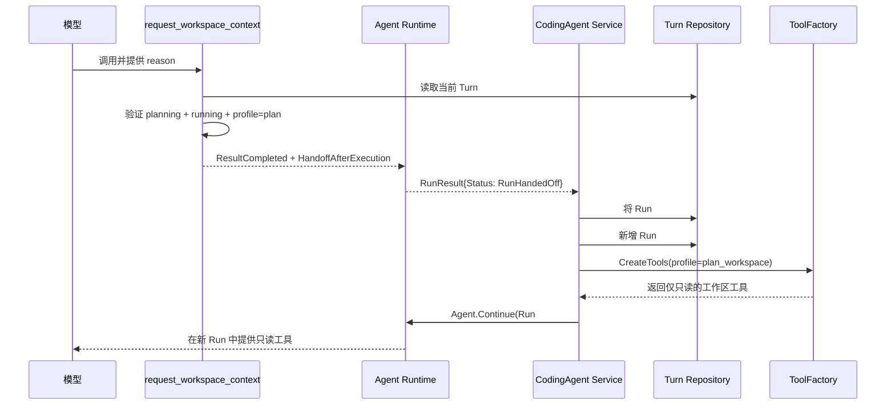

# Plan 功能实现与维护指南

本文从当前代码实现出发，说明 Plan 功能如何运行、为什么这样设计，以及后续修改时应关注什么。它面向第一次接触该功能的开发者。

## 先理解它解决的问题

普通对话会让 Agent 直接处理用户请求。Plan 模式则把一次请求拆成两个明确阶段：

1. **规划**：Agent 只分析需求和仓库，产出结构化、可审查的实施方案。
2. **决定与执行**：用户批准后，系统才允许开始实施；用户也可以要求修改方案或取消任务。

这不是“让模型先回复一段计划文本”，而是一套由产品状态机、工具权限和持久化记录共同约束的流程。

```text
/plan <需求>
  |
  v
planning（初始规划，不能读工作区）
  |
  |-- 若任务依赖仓库 --> request_workspace_context
  |                         |
  |                         v
  |                   planning（可只读调查工作区）
  |
  v
exit_plan_mode（提交结构化 Plan）
  |
  v
awaiting_plan_approval（等待用户）
  |                 |                    |
  | 批准 execute    | 要求修订             | 取消
  v                 v                    v
executing       planning（新版本）      cancelled
  |
  v
completed
```

如果 Plan 的交付物本身就是用户要的内容（例如调研方案、文章提纲），它会使用 `deliverable` 模式：批准后直接完成，不进入 `executing`。

## 从入口到执行的实际调用链

下面按代码真实发生的顺序阅读。最重要的入口是 `internal/codingagent/service.go` 的 `StartTurn()`。

### 第一步：UI 选择 Turn 模式

`internal/ui/command.go` 中的 `/plan` 命令最终调用：

```go
m.submitTurn(request, codingagent.TurnModePlan)
```

普通聊天输入则使用默认的 `TurnModeDirect`。UI 不直接操作 Plan、工具或 Agent；它只提交请求，并把后端返回的 Snapshot 和中断渲染出来。

### 第二步：Service 创建 Turn 和第一个 Run

`StartTurn()` 先创建并持久化一个 `Turn`，再为它附加第一个 `RunBinding`。两种模式在这里分叉：

| 项目 | 普通 Turn | Plan Turn |
|---|---|---|
| `TurnRequest.Mode` | `direct`（默认） | `plan` |
| 初始 `Turn.Phase` | `direct` | `planning` |
| 初始 `RunBinding.Profile` | `direct` | `plan` |
| `EntrySource` | `direct` | `user_plan` |

然后 Service 调用 `prepareRunEnvironment()`，最后调用 `Agent.Run()`。第一个 Run 是唯一会追加原始用户消息的 Run；Plan 后续产生的 Run 都会延续同一个 Turn，而不会伪造或重复一条用户消息。

### 第三步：按 Profile 拼装运行环境

`prepareRunEnvironment()` 在 `internal/codingagent/turn_coordinator.go` 中按以下顺序工作：

```text
加载当前 Worktree
  → ToolFactory.CreateTools(profile)
  → Plan profile 时追加流程控制工具
  → 从最终工具注册表获取工具名称
  → 构造 PromptScope
  → PromptBuilder.BuildSystemPrompt(PromptScope)
  → BuildUntrustedContext(PromptScope)
  → 返回 tools、system prompt、untrusted context、事件适配器
```

因此，提示词不会“猜测”自己有哪些工具；它从本次运行已经创建好的工具注册表中得到工具名称。工具可用性是可信的产品配置，仓库文本、模型回复和用户输入都不能自行扩大它。

### 第四步：初始 Plan 运行决定是否需要仓库

初始 Plan Run 使用 `CapabilityPlan`。模型此时不能查看文件，因此必须先根据用户需求判断：结果是否真的依赖当前工作区。

- **不依赖工作区**：可以询问必要的产品偏好，然后直接调用 `exit_plan_mode` 提交 `deliverable` Plan。
- **依赖工作区**：调用 `request_workspace_context`，并提供原因。

后一个工具的 `ControlPolicy` 是 `Exclusive + HandoffAfterExecution`。它成功后不会让当前 Run 原地“多出读权限”，而是结束当前 Run 并触发 Service 的 `continueTurnLocked()`：

```text
Run #1: profile=plan
  → request_workspace_context
  → Run #1 标为 handed_off
  → 新建 Run #2: profile=plan_workspace
  → Agent.Continue()
```

Run #2 共享同一 Turn、同一 Agent Session 和原始用户请求，但拥有只读的工作区调查能力。

### `request_workspace_context` 与 handoff 的流程图



### handoff 到底如何实现

`request_workspace_context` 的实现位于 `internal/codingagent/workspace_context_control.go`。它不读取文件，也不在内存中给当前 Agent “加权限”；它只做一次受控状态检查和控制结果返回：

1. 解析输入中的 `reason`，要求它非空、长度不超过限制且不包含 NUL 字符。
2. 从 `TurnRepository` 加载当前 Turn。
3. 确认 Turn 正处于 `planning`、状态为 `running`，并且活动 Run 的 profile 恰好是 `CapabilityPlan`。
4. 返回 `ResultCompleted`，其控制策略由 `ControlPolicy()` 声明为：

   ```go
   tool.ControlPolicy{
       Exclusive: true,
       HandoffAfterExecution: true,
   }
   ```

`Exclusive` 使控制工具成为当前运行的明确边界；`HandoffAfterExecution` 告诉 Agent Runtime：工具执行成功后，不要继续驱动模型对话，而要以 `RunHandedOff` 把控制权交还给产品层。这个通用处理位于 `internal/agent/runtime.go`，而非 Plan 工具自身。

接着，`Service.StartTurn()` 识别以下组合：

```text
RunResult.Status == RunHandedOff
Turn.Phase == planning
最新 Run 的 Profile == CapabilityPlan
```

满足条件后，它调用 `continueTurnLocked()`。该方法执行以下耐久化转换：

```text
Run #1: profile=plan, status=handed_off
  ↓
Turn 保持 planning
  ↓
追加 Run #2: phase=planning, profile=plan_workspace, status=pending
  ↓
Run #2 标记 running，并调用 Agent.Continue()
```

`Agent.Continue()` 使用同一 Agent Session，因此保留既有对话和工具结果；它使用新的 Run ID，因此产品层能够独立追踪这段工作区调查的生命周期。后续 Run 不会再次写入原始用户消息。

最后，`prepareRunEnvironment()` 将新的 profile 传给 `ToolFactory.CreateTools()`。`internal/codingagent/tools/factory.go` 仅在 `CapabilityPlanWorkspace` 下注册读文件、列目录、搜索代码和只读 Git 工具。**这一步才是 Agent 获得工作区读取能力的原因。**

工具返回中包含的 `{"workspace_relevant": true}` 是对模型和日志有意义的语义信息；当前 Service 不依赖它直接切换权限。权限切换的可信依据是控制工具的 handoff 策略、Turn 的已校验状态，以及新 Run 的 `CapabilityPlanWorkspace` profile。

### 第五步：提交、审批和继续

当模型调用 `exit_plan_mode` 时，`plan_control.go` 校验并保存 Plan 后返回 `plan_approval` 中断。当前 Run 进入 interrupted，Turn 进入 `awaiting_plan_approval`。

用户决定会经由 UI 调用 `Service.ResumeTurn()`：

```text
要求修订
  → Turn 改回 planning
  → Agent.Resume() 当前规划 Run
  → 提交 v2、v3 ... 并重新等待审批

批准 execute Plan
  → 校验 Plan ID、版本和摘要
  → 审批 Run 完成 handoff
  → Turn 改为 executing
  → 创建后续 Run(profile=direct)
  → Agent.Continue() 执行

批准 deliverable Plan
  → 当前 Run 直接完成
  → Turn 完成，不创建执行 Run
```

审批型 `exit_plan_mode` 的控制策略是 `Exclusive + HandoffAfterResolution`：它保证 Agent 在用户作出决定前不会一边等待审批、一边继续执行后续动作。

## 普通 Turn 与 Plan Turn 的实现差异

普通 Turn 和 Plan Turn 复用 Session、Turn、Agent Runtime、事件和权限基础设施；不同点在于它们选择的初始状态、Profile 以及后续状态转换。

### 普通 Turn

```text
StartTurn(mode=direct)
  → Turn(phase=direct)
  → Run(profile=direct)
  → 创建完整常规工具集
  → 拼装普通系统提示词与仓库指导上下文
  → Agent.Run()
  → 完成，或在某个具体工具的权限中断处 Resume
```

`CapabilityDirect` 拥有常规读取、修改和检查工具。写文件、执行检查等是否真的发生，仍由具体工具的权限边界决定。

### Plan Turn

```text
StartTurn(mode=plan)
  → Turn(phase=planning)
  → Run(profile=plan)
  → 只挂载流程控制工具
  → 拼装 Plan 专用只读提示词
  → 按需 handoff 到 profile=plan_workspace
  → 保存不可变 Plan 并等待审批
  → 获批后才 handoff 到 profile=direct 执行
```

Plan 的实现重点不是“多一次确认弹窗”，而是将**调查、方案审核、实施**拆为不同的状态和能力集。执行能力直到用户批准了一个确切的 Plan 版本后才出现。

## 用户入口和 UI

`internal/ui/command.go` 注册 `/plan [request]`：

- `/plan <需求>`：立即以 `TurnModePlan` 提交。
- `/plan`：切换到 Plan 输入状态，等待用户填写需求。

UI 不负责业务状态转换，只把操作映射为 Service 请求：

- `internal/ui/approval_picker.go`：展示“批准并执行 / 要求修订 / 取消任务”。
- `internal/ui/plan.go`：渲染当前 Plan 的目标、范围、发现、风险、步骤和验收标准。
- `internal/ui/model.go`：在快照存在 `ActivePlan` 时显示 Plan；有 `plan_approval` 中断时同时显示审批框。

要求修订时，UI 收集反馈，并以 `ResolutionDenied` 恢复同一个中断。这一点看起来反直觉：这里的 “Denied” 意味着“拒绝当前版本，请模型继续只读规划”，不是把整个任务判定为失败。

## 核心模型：Turn、Run 与 Plan

三个概念需要区分：

| 概念 | 定义 | 作用 |
|---|---|---|
| `Turn` | 一次用户请求的耐久产品对象 | 把规划、审批、执行的多个运行串成一个业务任务 |
| `Run` | Agent 的一次实际运行 | 一个 Turn 可以有多个 Run，例如初始规划、工作区调查、执行 |
| `Plan` | 一个不可变的结构化方案版本 | 保存用户审核的具体内容，并绑定到 Turn |

定义主要位于：

- `internal/codingagent/turn.go`
- `internal/codingagent/plan.go`
- `internal/codingagent/snapshot.go`

`Turn` 的关键阶段是：

```go
TurnPhasePlanning
TurnPhaseAwaitingPlanApproval
TurnPhaseExecuting
```

合法转换被 `ValidateTurnTransition` 限制为：

```text
planning -> awaiting_plan_approval
awaiting_plan_approval -> planning
awaiting_plan_approval -> executing
```

每个 Plan 都通过 `(PlanID, PlanVersion, PlanDigest)` 精确绑定到 Turn。`PlanDigest` 是对完整 Plan 内容计算的 SHA-256 摘要。因此，旧审批中断不能批准已经修订后的新方案。

## 规划阶段为什么能保证只读

只读不是靠模型“自觉”，而是由能力配置强制实现。

### 初始规划：`CapabilityPlan`

开始 `/plan` 时，`Service.StartTurn` 创建 `TurnPhasePlanning` + `CapabilityPlan` 的 Run（`internal/codingagent/service.go`）。工具工厂在此 profile 下不暴露工作区工具。

Service 只额外挂载三个控制工具：

| 工具 | 代码 | 用途 |
|---|---|---|
| `request_workspace_context` | `workspace_context_control.go` | 声明此方案确实需要当前仓库事实 |
| `request_user_input` | `clarification.go` | 询问会实质影响方案的用户选择 |
| `exit_plan_mode` | `plan_control.go` | 提交完整的结构化 Plan |

因此，初始规划不能读文件、不能执行 Git 命令，更不能修改文件或执行命令。

### 工作区相关规划：`CapabilityPlanWorkspace`

当模型调用 `request_workspace_context` 后，`turn_coordinator.go` 通过一次 control handoff 创建后续 Run，并切换到 `CapabilityPlanWorkspace`。

`internal/codingagent/tools/factory.go` 在这个 profile 下只提供：

```text
read_file, list_files, search_code,
git_status, git_diff, git_log, git_branches, git_show_commit
```

没有 `edit_file`、`create_file`、`replace_file`、`apply_patch`、`run_checks` 或 `language_server`。即使模型产生了错误意图，也无可执行的副作用工具。

系统提示在 `internal/codingagent/prompt/builder.go` 中描述行为约束；真正的安全边界仍然是上述工具集合。

## 提交 Plan 时发生什么

`exit_plan_mode` 是核心控制工具，实现在 `internal/codingagent/plan_control.go`。模型必须提交满足 JSON Schema 的 `PlanSubmission`，包括：

- 目标和包含/排除范围；
- 调查发现、假设和风险；
- 带 ID、依赖、文件预期和验证方式的步骤；
- 验收标准；
- `workspace_relevant`；
- `completion_mode`（`execute` 或 `deliverable`）。

产品侧随后执行以下操作：

1. 严格解析 JSON，拒绝未知字段和尾随内容。
2. 规范化步骤中的文件路径，拒绝绝对路径、`..` 逃逸和非便携路径。
3. 验证必填文本、大小限制、列表去重、步骤数量和文件数量。
4. 验证步骤 ID、依赖目标存在性和依赖环。
5. 限制执行策略为当前已实现的单 Agent 策略 `single`。
6. 要求 `execute` Plan 必须依赖当前工作区；工作区无关的 `deliverable` Plan 不得声明文件范围。
7. 对工作区相关 Plan 采集 Git HEAD 和 Git status 摘要。
8. 生成确定性的 Plan ID、递增版本号和内容摘要。
9. 保存 Plan，并把 Turn 切换到 `awaiting_plan_approval`。
10. 返回 `plan_approval` 中断。

`Plan` 验证逻辑在 `internal/codingagent/plan.go`；这也是修改字段、摘要算法或兼容策略时最需要同步维护的位置。

## 用户审批后发生什么

审批恢复入口是 `Service.ResumeTurn`（`internal/codingagent/service.go`）。

### 批准执行型 Plan

系统重新加载 Plan，并再次验证 Turn 记录的 ID、版本和摘要一致。之后协调器创建一个新的 `CapabilityDirect` Run，并把已批准 Plan 作为低优先级用户上下文传给执行 Agent。

此时才暴露常规实现工具，并继续沿用正常的权限审批机制。**批准 Plan 不等于授予写文件或执行命令权限。**

### 要求修订

Service 把 Turn 从 `awaiting_plan_approval` 切回 `planning`；模型获得用户反馈，仍在只读边界内生成完整的新版本 Plan。Plan ID 不变，版本号增加。

### 取消和交付型 Plan

- 取消：将任务作为取消结束，不启动执行 Run。
- 批准 `deliverable`：将任务标为完成，不启动执行 Run。

## 持久化、快照和事件

Plan 存储由 `PlanRepository` 抽象定义（`internal/codingagent/repository.go`）：

- `internal/codingstore/file/plan.go`：文件实现。版本以 `coding-plans/<plan-id>/vNNNN.json` 保存。
- `internal/codingstore/memory/repository.go`：内存实现，主要服务测试。

文件实现要求版本从 1 开始连续递增，并在加载时重新校验 Plan 摘要和结构。这会在异常时拒绝不完整或被篡改的历史。

`Service.Snapshot` 通过 `projectPlanSnapshot` 组装：

- `ActivePlan`：当前或最近一个 Plan；
- `PendingPlanApproval`：是否正等待 Plan 审批；
- `PlanHistory`：版本历史摘要。

`publishPlanEvent` 还会发布 started、created、revised、approved、cancelled 等 Plan 事件。事件载荷只带必要标识和经过敏感信息脱敏的目标文本。

## 维护时从哪里改

| 需求 | 首要修改点 | 必须同步检查 |
|---|---|---|
| 增加 Plan 字段 | `plan.go` | `PlanSubmission`、JSON Schema、规范化、摘要、快照、UI、文件兼容和测试 |
| 增加新的规划工具 | `prepareRunEnvironment`、`tools/factory.go` | 工具在两个 Plan profile 中的可见性，绝不能意外授予副作用能力 |
| 改变审批行为 | `plan_control.go`、`service.go` | `Turn` 状态转换、恢复逻辑、UI 文案和旧中断兼容 |
| 增加执行策略 | `turn.go`、`plan.go`、协调器 | 当前策略校验明确只接受 `single`；不能只放宽 enum 而不实现调度 |
| 改变 Plan 存储 | `codingstore/file/plan.go` | 不可变性、顺序版本、摘要验证、兼容读和崩溃恢复 |
| 改变界面内容 | `ui/plan.go`、`ui/approval_picker.go` | Service 的 `PlanSnapshot` 投影和 UI 测试 |

## 当前已知的维护关注点

### 工作区快照尚未用于执行前阻断

系统会记录 `WorkspaceRevision`，但当前代码并未在批准后、开始执行前重新采集并比较该快照。用户在审批间隙修改了工作区时，执行仍可能基于旧调查结果继续。

此外，`StatusDigest` 基于 `git status --porcelain` 输出；同一个已修改文件的内容再次变化、但状态仍为 `M` 时，该摘要不会变化。

后续若要增强可靠性，可在进入 `executing` 前比较工作区指纹；发生变化时要求用户重新规划、确认继续或取消。

### 历史版本会完整加载

`projectPlanSnapshot` 会读取关联 Plan 的全部版本，再保留最近 64 条历史摘要。当前没有实际的常规修订次数上限；大量反复修订会使快照读取和文件校验成本随版本数增长。

可考虑为 Repository 增加“读取最近 N 个版本”的接口，并为单个 Plan 定义合理的修订上限。

### Plan 写入和 Turn 绑定是两步操作

Plan 版本先持久化，再通过 CAS 更新 Turn 的 Plan 引用。系统有会话内操作锁和重放幂等处理，但异常发生在两步之间仍可能留下尚未被 Turn 引用的版本。

可以在恢复流程中增加孤儿 Plan 诊断或清理策略；若未来引入事务型存储，应将这两个写入放进同一事务。

## 回归测试

修改 Plan 功能后，优先运行：

```powershell
go test ./internal/codingagent ./internal/codingagent/tools ./internal/codingstore/file ./internal/ui
```

重点阅读和扩展以下测试：

- `internal/codingagent/plan_test.go`：结构、路径、依赖、摘要与兼容性。
- `internal/codingagent/service_test.go`：工作区 handoff、审批、修订、交付型 Plan 和同一 Turn 内执行。
- `internal/codingagent/tools/factory_test.go`：规划 profile 的只读工具边界。
- `internal/codingstore/repository_contract_test.go`：Plan 版本存储契约。
- `internal/ui/model_test.go`：Plan 命令、审批及修订输入。

修改时的底线是：**规划期不能产生副作用；审批必须精确绑定一个不可变版本；批准执行后仍必须经过普通权限控制；恢复后不得把旧审批应用到新版本。**
